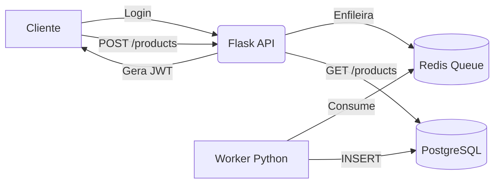

# 🚀 **Desafio Python + Flask + PostgreSQL + Redis**

### *API desenvolvida com clean code, arquitetura simples e desenvolvimento profissional.*

Este projeto implementa uma API completa com:

* Autenticação JWT
* CRUD básico de produtos
* Persistência assíncrona usando Redis como fila
* Worker dedicado para gravação no banco
* PostgreSQL para armazenamento persistente
* Documentação Swagger
* Ambiente dockerizado
* Testes automatizados com pytest

---

# 🧠 **Visão Geral da Arquitetura**



---

# 🔧 **Tecnologias Utilizadas**

| Tecnologia                  | Motivo                                                         |
| --------------------------- | -------------------------------------------------------------- |
| **Python 3.9+**             | Linguagem simples e amplamente utilizada.                      |
| **Flask 3**                 | Framework leve ideal para APIs rápidas.                        |
| **Flask-JWT-Extended**      | JWT implementado de forma simples e segura.                    |
| **SQLAlchemy**              | ORM poderoso para manipular o banco.                           |
| **PostgreSQL**              | Banco robusto, padrão do mercado.                              |
| **Redis**                   | Ideal para filas rápidas e processamento assíncrono.           |
| **Docker + docker-compose** | Facilita execução com todos os serviços.                       |
| **Pytest**                  | Testes simples e rápidos, ideais para validar funcionalidades. |

---

# 📁 **Estrutura do Projeto (com testes incluídos)**

```
backend/
│
├── app/
│   ├── __init__.py        # Inicializa app e banco
│   ├── auth.py            # Rota de login e JWT
│   ├── products.py        # Rotas de produto + Redis
│   ├── models.py          # Modelos SQLAlchemy
│   └── worker.py          # Worker da fila
│
├── tests/
│   ├── test_auth.py       # Testes de login
│   └── test_products.py   # Testes de rotas protegidas
│
├── seed_user.py           # Cria usuário inicial
├── run.py                 # Executa API Flask
├── requirements.txt       # Dependências
├── openapi.yaml           # Swagger
└── README.md              # Este documento
```

---

# 🔐 **Autenticação**

A API usa **JWT Bearer Token**.

### Endpoint de login

```
POST /auth/login
```

### Corpo da requisição:

```json
{
  "email": "admin@admin.com",
  "password": "123456"
}
```

### Resposta:

```json
{
  "token": "jwt-gerado-aqui"
}
```

Esse token deve ser enviado em rotas protegidas:

```
Authorization: Bearer <token>
```

---

# 🛒 **Rotas de Produtos**

## ✔ GET /products

Retorna todos os produtos gravados no banco.

## ✔ POST /products

Enfileira um produto no Redis para ser processado pelo Worker.

### Exemplo de envio:

```json
{
  "nome": "Produto Teste",
  "marca": "Marca X",
  "valor": 79.90
}
```

### Resposta:

```json
{ "msg": "Produto enfileirado" }
```

---

# ⚙ **Worker Assíncrono**

O Worker lê mensagens da fila:

```
queue_products
```

E salva no PostgreSQL.

### Execute com:

```
python3 -m app.worker
```

---

# 🧪 **Testes Automatizados (Pytest)**

### 📁 tests/test_auth.py

* Valida login com credenciais corretas.
* Garante que token JWT é retornado.

### 📁 tests/test_products.py

* Garante que rota protegida sem token retorna 401.
* Base para expandir futuramente.

### Rodar testes:

```
pytest
```

---

# 📘 **Documentação Swagger**

O arquivo **openapi.yaml** inclui toda a especificação da API.

Abra em:

👉 [https://editor.swagger.io/](https://editor.swagger.io/)

---

# 🐳 **Executar o projeto com Docker**

### 1️⃣ Build + run

```
docker-compose up --build
```

### 2️⃣ Serviços disponíveis

| Serviço    | Porta                                          |
| ---------- | ---------------------------------------------- |
| Flask API  | [http://localhost:5000](http://localhost:5000) |
| PostgreSQL | 5432                                           |
| Redis      | 6379                                           |

A API roda automaticamente no serviço **api**.

---
